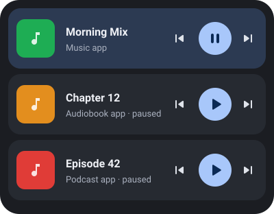
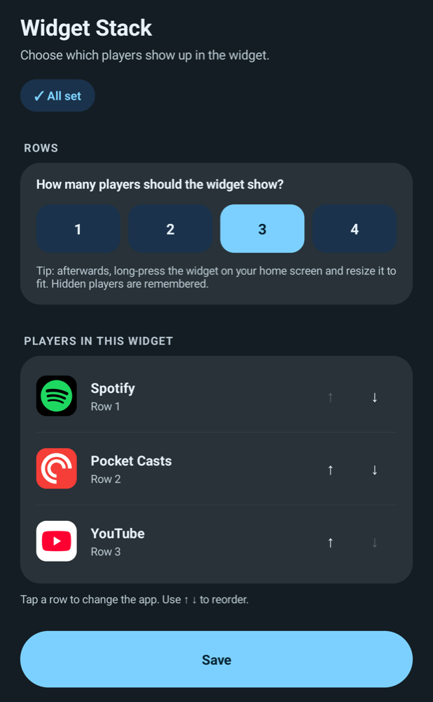

<p align="center">
  
</p>

<h1 align="center">Widget Stack</h1>

<p align="center">
  <b>All your media players in one home screen widget.</b><br>
  Spotify, Audible, Pocket Casts &amp; co., stacked, always in reach, no clutter.
</p>

<p align="center">
  <a href="https://github.com/Intersebbtor/widget-stack/releases/latest"><b>Download APK</b></a> ·
  Android 12+ · No internet permission · MIT
</p>

---

## Why

You listen to music in one app, audiobooks in another and podcasts in a third. Each app ships its own widget, and each one eats a chunk of your home screen. The system media controls only show whatever played last.

**Widget Stack** puts one compact row per app into a single widget. Every row has cover art, title, and back / play-pause / forward controls. Rows stay there even when the app isn't running, so you can pick up the audiobook right where you left off.

### Typical use case

You run a minimal launcher (Niagara, Lawnchair, Nova, Smart Launcher, ...) and want *one* tidy media block instead of three app widgets. Place Widget Stack once, choose which app goes into which row, done.

## Features



- **1 to 4 rows per widget**, each bound to an app you choose. Several widgets with different setups are possible.
- **Live state:** cover art, title, artist/show, and a highlighted row for what's currently playing
- **Works with any app that has proper media controls:** Spotify, YouTube Music, Audible, Pocket Casts, AntennaPod, Tidal, Deezer, Amazon Music, Apple Music, ...
- **Smart buttons:** podcast and audiobook apps that don't support "next track" get their own skip back/forward (e.g. 15 s) instead
- **Resume from cold:** the row remembers the last played item. ▶ tries to resume playback even when the app isn't running
- **Tap the cover or title** to jump into the app
- **Material You:** follows your wallpaper colors, light and dark
- **Resizable:** rows share the height you give the widget
- **Private by design:** no internet permission, no analytics, no accounts. Nothing leaves your phone.
- English and German UI

<br clear="right">

## How it works

Android does not allow a widget to contain other apps' widgets. So Widget Stack draws its own player rows and reads the media sessions Android already exposes. That's the same data your lock screen and quick settings use.

To read media sessions, Android requires **notification access**. Widget Stack only uses it to see media sessions. It does not read, store or send notification content.

## Install

1. Download the latest `WidgetStack-x.y.z-release.apk` from [Releases](https://github.com/Intersebbtor/widget-stack/releases/latest) and install it.
2. Open **Widget Stack** and tap **Grant** next to *Notification access*.
3. Long-press your home screen → **Widgets** → **Widget Stack**, place it, and pick your apps.

### "Restricted setting" / switch is greyed out

Android 13+ blocks notification access for apps installed outside an app store. To unlock it:

1. Try to enable the switch once (you'll get the "restricted setting" dialog).
2. Go to **Settings → Apps → Widget Stack**, tap **⋮** (top right) → **Allow restricted settings**.
3. Enable notification access again.

Or install via adb, which skips the restriction entirely:

```bash
adb install WidgetStack-1.0.0-release.apk
```

### Battery optimisation

Some vendors (OnePlus, Oppo, Xiaomi, Samsung, ...) kill background services aggressively, which can freeze the widget. The app shows a one-tap button to exempt it from battery optimisation. See [dontkillmyapp.com](https://dontkillmyapp.com) for vendor-specific tips.

## Known limitations

- An app that hasn't been opened since reboot has no media session yet. Widget Stack then shows the last known item, and ▶ tries to resume via the app's media browser service. A few apps refuse that. Tapping the row opens the app instead.
- Some apps provide cover art only as a URL, not as an image. Those rows fall back to the app icon.
- Not every launcher offers "reconfigure widget". You can always change a widget from the Widget Stack app itself.

## Build from source

Requires JDK 17+ and the Android SDK (compileSdk 36).

```bash
./gradlew assembleRelease
```

Without a `keystore.properties` the build is signed with your debug key. For your own signed builds create `keystore.properties` in the project root:

```properties
storeFile=/path/to/release.jks
storePassword=...
keyAlias=...
keyPassword=...
```

No third-party dependencies. Only the Android framework and Kotlin.

## License

[MIT](LICENSE)
